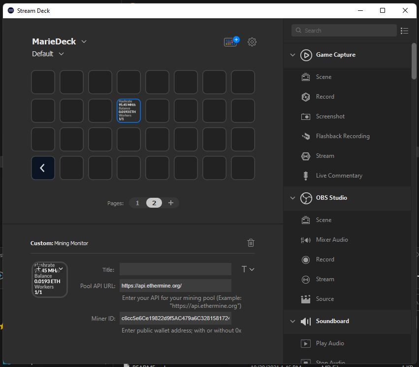

# StreamDeck Mining Monitor

## Description

Mining Monitor is a StreamDeck plugin that allows you to monitor pool APIs like Ethermine, Ethpool, and Flypool.

## Screenshots

## Installation

Download the plugin from the Github Releases and double click the package. Mining Monitor will then be available under Custom.

## Caveats

* Only tested with Ethermine
* Not localized
* Haven't yet reworked propertyinspector to be cleaner

## Todo

* Graphs for hashrate statistics
* Clean up Property Inspector
